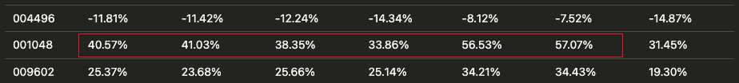
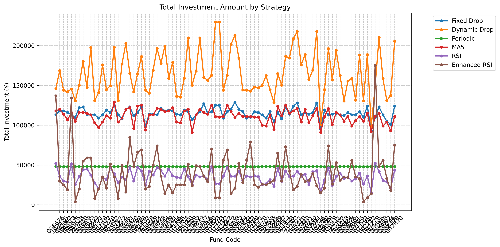

一个简单的基金策略，基于RSI和每日价格变化。

# 不同策略的对比
## 收益

从 89 个基金的模拟结果来看， RSI/Enhanced RSI 策略的收益最高，对比其他策略平均下来有平均 5 个点的提升。
个别基金上，比如 001048 甚至有 15 个点的提升。

具体数据见：[profit](results/comparison/profit.md)

## 投资额度

- Dynamic drop 的平均投资额度最高，平均下来有 164787.69 元
- Fixed drop 居其次，平均下来有 115272.73 元
- MA Cross 策略的平均投资额度最低，平均下来只有 13659.09 元
- RSI 策略的平均投资额度较低，平均下来 35545.45 元。 当然，可以通过提高单次的投资额度来提高总投入。
- Enhanced RSI 策略的平均投资额度居中，平均下来有 83677.32 元

具体数据见：[total_investment](results/comparison/total_investment.md)

## 投资频率

- Dynamic drop 跟 Fixed drop 首当其冲，平均下来有 115.3 次，二者频率一致，就额度上有差异
- RSI/Enhanced RSI 策略的平均投资频率 53.2 次
- 每周定投（periodic）当然是 48 次了
- MA Cross 策略只有 6.8 次

具体数据见：[frequency](results/comparison/frequency_count.md)
