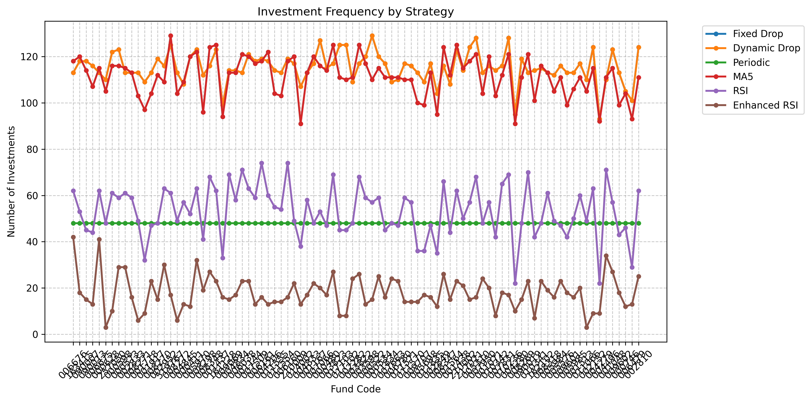

不同投资策略的对比

# 不同策略的对比
## 收益

从 89 个基金的模拟结果来看:
- RSI/Enhanced RSI 策略的收益最高，对比其他策略平均下来有平均 5 个点的提升。个别基金上，比如 001048 甚至有 15 个点的提升。
- RSI v.s. Enhanced RSI 策略没有特别大的差异。
- Fixed drop, Dynamic drop, periodic 策略的收益差异不大。平均下来只差一个点，而且在很多基金上都是个位或者小数点后一位的差异。考虑到 periodic 比较省心，普通用户可以考虑这个策略。

平均收益结果：
| Fund Code | Fixed Drop | Dynamic Drop | Periodic | MA Cross | RSI | Enhanced RSI | Value Avg |
|-----------|---------------|---------------|---------------|---------------|---------------|---------------|---------------|
| Average | 19.24% | 19.24% | 18.23% | 17.79% | 24.60% | 24.79% | 13.77% |

具体数据见：[profit](results/comparison/profit.md)

## 投资额度

投资总额从高到低：
- Dynamic drop 的平均投资额度最高，平均下来有 164787.69 元
- Fixed drop 居其次，平均下来有 115272.73 元
- Enhanced RSI 策略的平均投资额度居中，平均下来有 83677.32 元
- 每周定投（periodic）的投资额度 48000，稳稳当当。当然这个可以等比放缩，如果每次 X2 就是 96000 了。
- RSI 策略的平均投资额度较低，平均下来 35545.45 元。 当然，可以通过提高单次的投资额度来提高总投入。
- MA Cross 策略的平均投资额度最低，平均下来只有 13659.09 元

具体数据见：[total_investment](results/comparison/total_investment.md)

## 投资频率

- Dynamic drop 跟 Fixed drop 首当其冲，平均下来有 115.3 次，二者频率一致，就额度上有差异（图中线条重合）。
- RSI/Enhanced RSI 策略的平均投资频率 53.2 次，从图上可以看到，集中在 40 ~ 70 之间。
- 每周定投（periodic）当然是 48 次了
- MA Cross 策略只有 6.8 次

具体数据见：[frequency_count](results/comparison/frequency_count.md)

# 小结
- 图省心，选 periodic 策略。选好基金，设定好投资额度，后面就完全不用管了。
- 考虑收益，选 RSI/Enhanced RSI 策略。但要注意，RSI 策略的收益波动比较大，并且会集中在短时间内集中投资，这段时间正是基金基本面比较差的时间段，有时候会连续 20 天 RSI 都低于 40。
