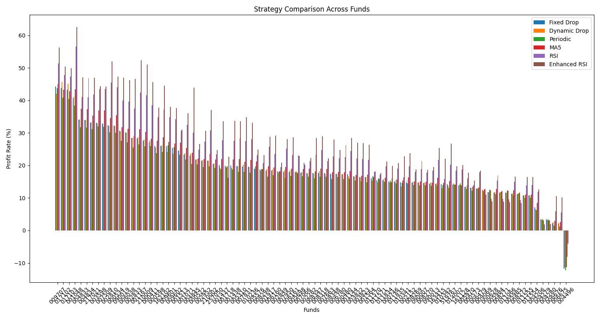

# 不同投资策略的收益率回测对比

## 收益

从 89 个基金的模拟结果来看:

- RSI/Enhanced RSI 策略的收益最高，对比其他策略平均下来有平均 5 个点的提升。个别基金上，比如 001048 甚至有 15 个点的提升。
  - RSI v.s. Enhanced RSI 策略没有特别大的差异。
  - 2025-0108，优化后的 Enhanced RSI 策略还是挺不错的，比 RSI 策略的收益高 3 个点。
- Fixed drop, Dynamic drop, periodic 策略的收益差异不大。平均下来只差一个点，而且在很多基金上都是个位或者小数点后一位的差异。考虑到 periodic 比较省心，普通用户可以考虑这个策略。
- MA5 策略收益率适中，比定投效果好。

平均收益结果：
| Fund Code | Fixed Drop | Dynamic Drop | Periodic | MA5 | RSI | Enhanced RSI |
|--------|---------|-------|---------|---------|---------|---------|
| Average | 19.24% | 19.24% | 18.23% | 20.30% | 24.60% | 27.62% |

具体数据见：[profit](../results/comparison/profit.md)

## 投资额度

> 这组结果没有特别大的意义，仅作为直观参考，毕竟所有金额都可以等比放缩。更重要的是投资频率，见下节。

具体数据见：[total_investment](../results/comparison/total_investment.md)

## 投资频率

- Dynamic drop 跟 Fixed drop 首当其冲，平均下来有 115.3 次，二者频率一致，就额度上有差异（图中线条重合）。
  - 毕竟只要净值下降，就触发投资，频率高是必然的。
- MA5 策略有 111.4 次，跟 dynamic drop 差不多。
- RSI 策略的平均投资频率 53.2 次，从图上可以看到，集中在 40 ~ 70 之间。
- Enhanced RSI 策略的平均投资频率 17.9，多数在 10 ~ 30 之间。
- 每周定投（periodic）当然是 48 次了

具体数据见：[frequency_count](../results/comparison/frequency_count.md)

# 小结

- 图省心，选 periodic 策略。选好基金，设定好投资额度，后面就完全不用管了。但同样也是平均收益率最低的。
- dynamic drop/fixed drop/ma 策略都是逢低补仓，所以投资频率都很高，收益率较 periodic 好一点（平均 1 个点）。但 ma 的效果好一点（平均 2 个点），因为 ma 相当于在一段低谷区投了更多，更 dynamic drop 只看重当天是否下跌。
- 考虑收益，选 RSI/Enhanced RSI 策略，平均比定投高 6 ～ 9 个点。但要注意，RSI 策略的收益波动比较大，并且会集中在短时间内集中投资，这段时间正是基金基本面比较差的时间段，有时候会连续 20 天 RSI 都低于 40，所以连投 20 天，越投越跌，对心理承受能力是个考验。
